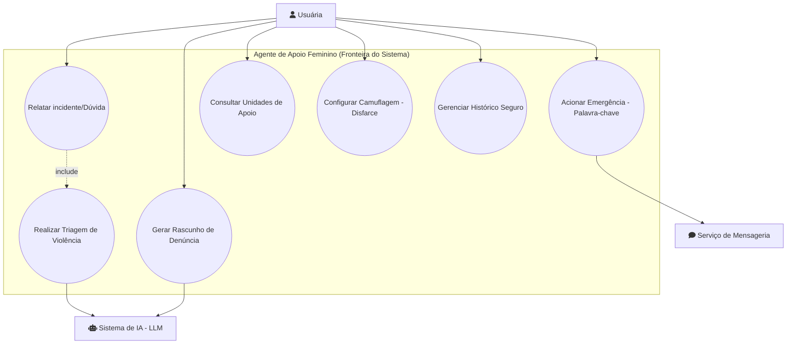
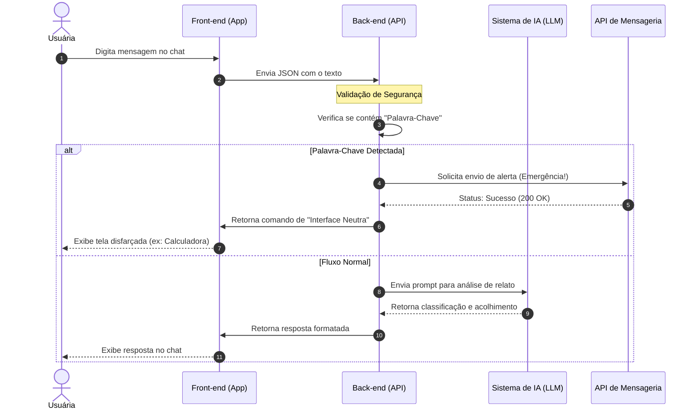

# Projeto Sentinela: Apoio à Mulher

---

## 📖 Sobre o Projeto
Este é um agente inteligente desenvolvido para auxiliar mulheres em situação de vulnerabilidade, ajudando na identificação de abusos, coleta de provas e estruturação de denúncias baseadas na Lei Maria da Penha.

## 📂 Estrutura do Projeto

* [Fase 1: Pesquisa e Curadoria](./fase_1_pesquisa/) - Documentação legal e contatos.
* [Fase 2: Diagnóstico com IA](./fase_2_diagnostico/) - Código de análise de prints.
* [Fase 3: Assistente de Ação](./fase_3_acao/) - Gerador de relatórios para denúncia.

## 📋 REQUISITOS FUNCIONAIS (RF)
*O que o sistema deve fazer (Funcionalidades)*

* **[RF01] Triagem de Relatos:** A IA deve analisar o texto da usuária e classificar o tipo de violência (física, psicológica, patrimonial, etc.) com base no relato.
* **[RF02] Guia de Unidades de Apoio:** O sistema deve listar contatos, telefones de emergência e localização de delegacias da mulher e centros de acolhimento.
* **[RF03] Gerador de Denúncia:** A IA deve organizar as informações relatadas em um rascunho estruturado (formato jurídico/policial) para facilitar o boletim de ocorrência.
* **[RF04] Botão de Saída Rápida:** Funcionalidade de emergência que fecha o app instantaneamente ou camufla a interface para uma tela neutra.
* **[RF05] Histórico Protegido:** Armazenamento seguro de logs de conversa para que a usuária consulte evidências ou evoluções de fatos futuramente.
* **[RF06] Cadastro de Emergência:** O sistema deve permitir o pré-cadastro de uma "Palavra-Chave" de socorro e de um contato de confiança.
* **[RF07] Camuflagem de Interface (App Invisível):** O sistema deve permitir que a usuária altere o ícone e o nome do aplicativo na tela inicial (ex: disfarçar como "Calculadora" ou "Clima").
* **[RF08] Acionamento de Emergência:** O sistema deve disparar um alerta automático para o contato de confiança assim que a palavra-chave for detectada no chat.

---

## ⚙️ REQUISITOS NÃO FUNCIONAIS (RNF)
*Como o sistema deve se comportar (Qualidade e Segurança)*

* **[RNF01] Criptografia:** Todos os dados sensíveis e relatos devem ser criptografados de ponta a ponta, seguindo os padrões da **LGPD**.
* **[RNF02] Baixa Latência:** O tempo de resposta do agente de IA não deve ultrapassar **5 segundos** para garantir fluidez em momentos críticos.
* **[RNF03] Usabilidade (UX):** A interface deve ser minimalista, limpa e intuitiva, projetada para uso sob alto estresse emocional.
* **[RNF04] Disponibilidade:** O serviço deve possuir alta disponibilidade (SLA de 99.9%), operando 24 horas por dia.
* **[RNF05] Anonimato Opcional:** O sistema deve permitir o uso das funções de orientação sem a obrigatoriedade de cadastro nominal imediato.
* **[RNF06] Confiabilidade do Alerta:** O sistema de notificação de emergência (disparado via palavra-chave) deve garantir o envio da mensagem em até **10 segundos**.
* **[RNF07] Ofuscação de Presença:** O aplicativo não deve exibir notificações com conteúdo explícito na tela de bloqueio, garantindo discrição total perante terceiros.

---

## Diagrama de uso

---
## Diagrama de Sequência (em andamento)

